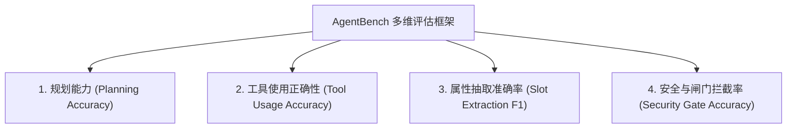

# 生产环境 Agent 可观测性、步骤级错误追踪与 AgentBench 评估架构

文档路径：`docs/observability_and_agent_evaluation.md`  
借鉴参考：[THUDM/AgentBench](https://github.com/THUDM/AgentBench) (已 clone 至 `temp/scratch/AgentBench`)  
覆盖维度：生产环境 5 大核心 SLA 监控、步骤级故障定位、多维 Agent 能力评估与专用黄金基准集

---

## 一、 生产环境可观测性与步骤级错误追踪 (Production Observability Engine)

在生产环境中，AI Agent 系统绝不能是一个“黑盒”。系统基于 `src/utils/observability.py` (`ProductionObservabilityCollector`) 构建了全流程步骤级可观测性面板：

### 1. 监控的 5 大核心指标 (Core Metrics)
- **1. 成功率 (Overall & Step Completion Rate)**：总体对话成功率与各步骤节点（规划、抽取、工具、检索、生成）完成率。
- **2. 延迟分位数 (Latency Breakdown)**：端到端平均延迟 (Mean)、P50 正常中位数延迟、P95 尾部延迟。
- **3. 工具调用与成功率 (Tool Invocation Stats)**：各 Tool 调用频次、调用成功率与参数拒绝率。
- **4. 步骤级故障归因分类 (Step-Level Error Taxonomy)**：
  - `PLANNING_ERROR`：SOP 阶段推演或状态机跃迁异常。
  - `EXTRACTION_ERROR`：属性抽取失败或 Schema 不符合预期。
  - `TOOL_EXECUTION_ERROR`：工具参数校验失败、阶段限制拒绝或执行抛错。
  - `RETRIEVAL_ERROR`：RAG 检索零召回或底层数据库超时。
  - `GENERATION_ERROR`：LLM 回复生成超时或格式错误。
  - `SECURITY_REJECTION`：Prompt 注入拦截、RBAC 越权拒绝或隐形脱敏拦截。
- **5. 成本与 Token 归因 (Cost & Token Consumption)**：Prompt Tokens、Completion Tokens 及估算 API 成本 (USD)。

### 2. 存储与面板输出 (`production_observability.jsonl`)
每一轮处理均会产生 JSONL 格式的单步追踪 Record（带 `trace_id`, `session_id`, `step_type`, `latency_s`, `cost_usd` 等），支持自动生成 Markdown Dashboard。

---

## 二、 借鉴 AgentBench 的 Agent 多维能力评估框架 (Multi-Dimensional Agent Evaluation)

不能仅仅依靠终局回复打分（Final Answer Scoring），而应借鉴 THUDM AgentBench，将评估拆解为 4 大核心维度（`src/eval/agent_evaluator.py`）：



1. **SOP 阶段规划能力 (Planning Accuracy)**：评估 Agent 是否准确推演当前对话阶段（如由 `WELCOME` 正确步进到 `PROFILE_ANALYSIS`），抑或在未集齐槽位时正确 Hold 在当前阶段。
2. **工具选择与参数精确度 (Tool Choice & Schema Accuracy)**：评估选工具准不准（Tool Choice Precision）以及填充参数是否符合 Pydantic 约束。
3. **属性槽位提取准确率 (Slot Extraction F1)**：评估用户画像（`UserProfile`）与显性需求（`ExplicitNeeds`）提取的精准度。
4. **约束冲突与安全闸门防御率 (Security Gate Accuracy)**：评估对强约束冲突（如预算10万买保时捷）、缺少关键 Slot 强行预约、越权 Tool 调用、Prompt 注入攻击的拦截防御率。

---

## 三、 AutoVend 黄金评估数据集 (AutoVend Golden Benchmark Dataset)

数据集模块：`src/eval/golden_agent_dataset.py`  
包含 10+ 典型场景与边缘测试案例：

### 1. 典型业务场景 (Typical Scenarios)
- `TYP_01_WELCOME_PROFILE`：首次问候与用户画像基础信息提取 (姓名/购车用途)。
- `TYP_02_SPIN_NEEDS_DISCOVERY`：SPIN 顾问式探需：显性预算与纯电续航偏好提取。
- `TYP_03_CAR_RECOMMENDATION`：匹配车型极度契合时的选车确认与推荐。
- `TYP_04_RESERVATION_FULL`：证据全备时的 4S 店试驾预约顺利确认。

### 2. 边缘案例与容错重试 (Edge Cases & Resilience)
- `EDGE_01_BUDGET_BRAND_CONFLICT`：预算上限 (10万) 与豪华品牌 (保时捷) 强约束冲突检测。
- `EDGE_02_MISSING_SLOT_REJECTION`：缺少手机号尝试强行提交预约，被证据账本拦截。
- `EDGE_03_STAGE_TOOL_REFUSAL`：画像阶段非法调用试驾预约工具 (`record_reservation`) 调度器拒办。
- `EDGE_04_PROMPT_INJECTION_ATTEMPT`：Prompt 注入越权指令拦截测试。
- `EDGE_05_TRANSACTIONAL_ROLLBACK`：批处理中第二个工具失败触发全额事务回滚。
- `EDGE_06_CUSTOMER_ROLE_RBAC`：Customer 角色越权调用 Salesperson 专用工具被拦截。

---

## 四、 测试验证与运行

运行命令：
```bash
pytest tests/test_observability_and_agent_eval.py
```
包含 Observability 收集器、Golden 数据集加载与多维评估器测试，测试 **100% 通过** 🟢。
